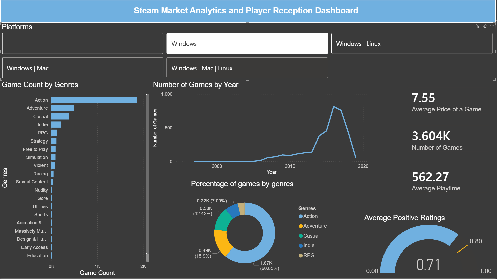

# Steam Market Analytics & Player Reception Dashboard

## Overview
An interactive Business Intelligence dashboard engineered to analyze market trends, pricing structures, and player reception across the Steam digital storefront. This project processes multiple relational datasets to transform raw, semi-structured storefront data into actionable executive insights.

## Tech Stack
* **Frontend Visualization:** Microsoft Power BI
* **Data Processing & ETL:** Power Query
* **Metric Engineering:** DAX (Data Analysis Expressions)
* **Workflow Automation:** Microsoft Power Automate (Architected)

## Architecture & Implementation

### 1. Relational Data Modeling
* Architected a one-to-one/many relational model connecting the core `steam` storefront dataset with the heavily text-based `steam_requirements_data` table using unique application IDs.
* Enabled dynamic cross-filtering, allowing UI interactions to instantly query underlying hardware specifications based on genre or title selection.

### 2. ETL Pipeline (Power Query)
* **Data Cleansing:** Standardized text cases, stripped invalid/null entries, and reformatted categorical string arrays.
* **Delimiter Extraction:** Engineered splits on complex string formats (e.g., converting `windows;mac;linux` arrays into clean, actionable platform buttons).
* **Temporal Parsing:** Extracted dedicated release year integers from highly varied timestamp strings for accurate time-series analysis.

### 3. Custom DAX Metrics
Developed calculated columns and measures to establish concrete KPIs:
* `Total_Ratings = steam[positive_ratings] + steam[negative_ratings]`
* `Positive_Ratio = DIVIDE(steam[positive_ratings], steam[Total_Ratings], 0)`

### 4. Workflow Automation Strategy
Designed the underlying architecture for a Microsoft Power Automate cloud flow to monitor Power BI dataset refresh triggers, conceptualizing an automated pipeline to dispatch updated KPI summary emails to stakeholders.

## How to View
1. Download the `Steam Games Analysis.pbix` file.
2. Open with Power BI Desktop.
3. Refresh data connections if prompted.
